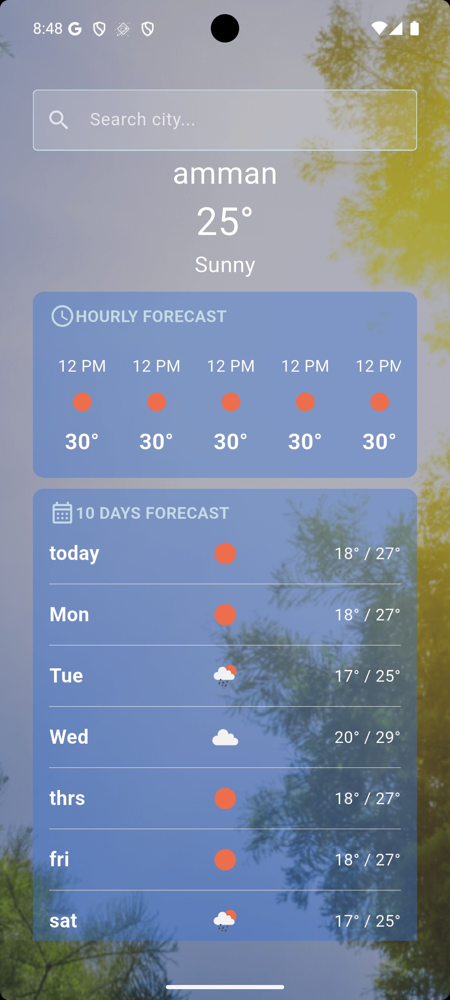

````md
# Weather App 🌤️

[](https://flutter.dev/)
[](https://dart.dev/)
[](https://openweathermap.org/)
A clean, modern Flutter weather application built to demonstrate real-world REST API integration, asynchronous data fetching, state management, and device location services.

## 📱 Features

- 🌡️ **Real-time Metrics:** Current temperature, weather conditions, humidity, wind speed, atmospheric pressure, and visibility.
- 📍 **Location-Based Weather:** Fetches live weather data based on current GPS coordinates.
- 🔎 **City Search:** Ability to search and inspect weather for any global city.
- 🎨 **Dynamic UI:** Weather icons mapped directly from OpenWeather API responses.

## 📸 Screenshots
<p align="left">
  
  &nbsp;&nbsp;
   
</p>

## 🧠 Key Concepts Applied

This project serves as a hands-on implementation of the following core software engineering and Flutter concepts:

- **REST API Integration:** Executing HTTP requests, handling async responses, and decoding JSON payloads.
- **Data Modeling:** Building robust Dart data models using `factory` constructors (`fromJson`) for type-safe parsing.
- **State Management:** Utilizing **Provider** with `ChangeNotifier` to handle app states (loading, success, error) and decouple logic from the UI.
- **Network Connectivity:** Implementing an internet connectivity checker wrapper to detect offline states and handle network availability gracefully.
- **Architecture & Layering:** Enforcing Separation of Concerns (SoC) by structuring code into Services, Models, Providers, and Views.
- **Location Services:** Handling runtime permissions and converting raw lat/long coordinates into localized weather data using `Geolocator`.
- **Asynchronous Dart:** Effective management of `Future`, `async/await`, and non-blocking background operations.

---

## 🏗️ Architecture & Folder Structure

The app follows a unidirectional data flow pattern to keep components loosely coupled:

```text
UI (Screens/Widgets) ──► Provider ──► Service ──► OpenWeather REST API
         ▲                                                │
         └──────────────── Models ◄────── JSON Response ◄─┘
```

---

## 🛠️ Tech Stack & Packages

- **Framework:** Flutter (Dart)
- **State Management:** `provider`
- **Networking:** `http`
- **Location Services:** `geolocator`
- **API:** [OpenWeatherMap API](https://openweathermap.org/api)

---

## 🚀 Getting Started

### Prerequisites
Make sure you have Flutter installed and an active API Key from [OpenWeatherMap](https://home.openweathermap.org/users/sign_up).

### Installation

1. **Clone the repository:**
   ```bash
git clone https://github.com/bayanhassoneh/weather-app.git
   cd weather-app
   ```

2. **Install dependencies:**
   ```bash
   flutter pub get
   ```

3. **Configure API Key:**
  Create your API configuration file and add your OpenWeather API key:
   ```dart
   static const String apiKey = 'YOUR_OPENWEATHER_API_KEY';
   ```

4. **Run the app:**
   ```bash
   flutter run
   ```

---


